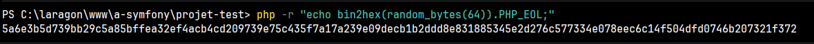

# docker-compose
### service : app
install php8.2 dans le container docker,  créer 1 bind volume et 2 named volumes (ne se supprime pas lors d'un docker compose up)
### service : webserver
install nginx, 2 bind volume 1 named, le service webserver depends de "app" et ne se lance pas si celui-ci plante
### service : database
install mysql, défini les variable d'environement contenu dans le .env, 1 named volume
## adminer & phpmyadmin
servent a visualiser la base de donnée avec une interface graphique


# dockerfile
verifie les mise a jour, install le packet curl + unzip + git afin de telecharger/décompresser composer, install composer, déplace composer 

# default.conf


# pour générer une clé en hexadecimal 64octet
```
php -r "echo bin2hex(random_bytes(64)).PHP_EOL;"
```

####  l'équivalent existe avec OpenSSL : ``` openssl rand -hex 64 ```
